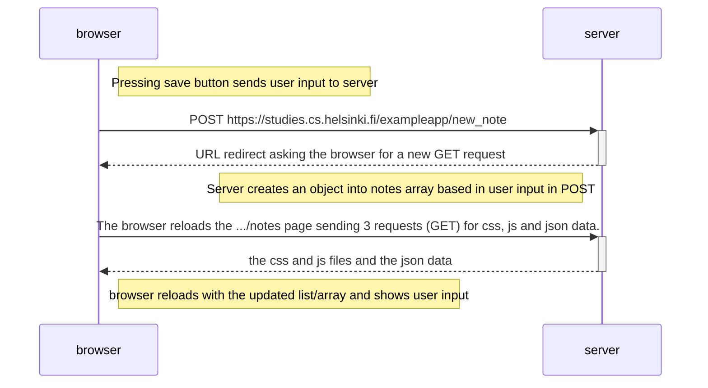

```mermaid
sequenceDiagram
    Note right of browser: Pressing save button sends user input to server
    browser->>+server: POST https://studies.cs.helsinki.fi/exampleapp/new_note
    
    server-->>-browser: URL redirect asking the browser for a new GET request
    note left of server: Server creates an object into notes array based in user input in POST

    browser->>+server: The browser reloads the .../notes page sending 3 requests (GET) for css, js and json data.
    

    server-->>-browser: the css and js files and the json data
    note right of browser: browser reloads with the updated list/array and shows user input

    
``` 
