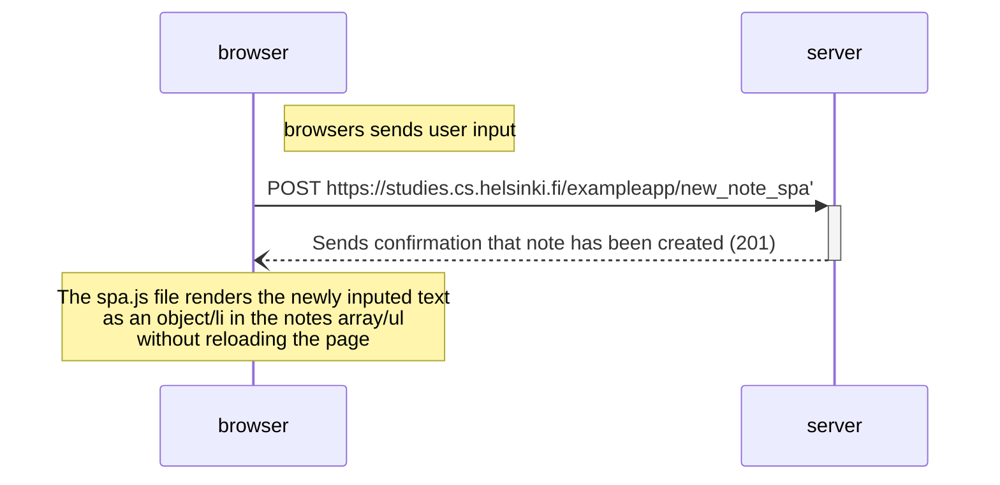

```mermaid
sequenceDiagram
  Note right of browser:browsers sends user input
  browser->>+server: POST https://studies.cs.helsinki.fi/exampleapp/new_note_spa'
  server--)-browser: Sends confirmation that note has been created (201)
  Note over browser: The spa.js file renders the newly inputed text <br/> as an object/li in the notes array/ul<br/>without reloading the page
```
