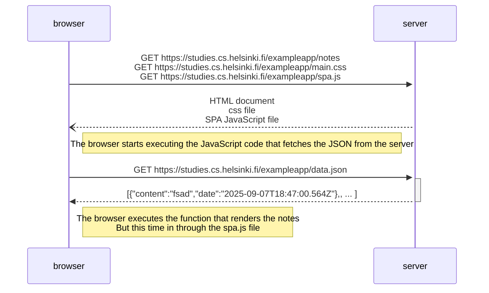

```mermaid
sequenceDiagram
    participant browser
    participant server

    browser->>+server: GET https://studies.cs.helsinki.fi/exampleapp/notes <br/> GET https://studies.cs.helsinki.fi/exampleapp/main.css <br/> GET https://studies.cs.helsinki.fi/exampleapp/spa.js
    server--)browser: HTML document <br/> css file <br/> SPA JavaScript file
    

    

    Note right of browser: The browser starts executing the JavaScript code that fetches the JSON from the server

    browser->>+server: GET https://studies.cs.helsinki.fi/exampleapp/data.json
    
    server-->>-browser: [{"content":"fsad","date":"2025-09-07T18:47:00.564Z"},, ... ]
    

    Note right of browser: The browser executes the function that renders the notes <br/> But this time in through the spa.js file
```
